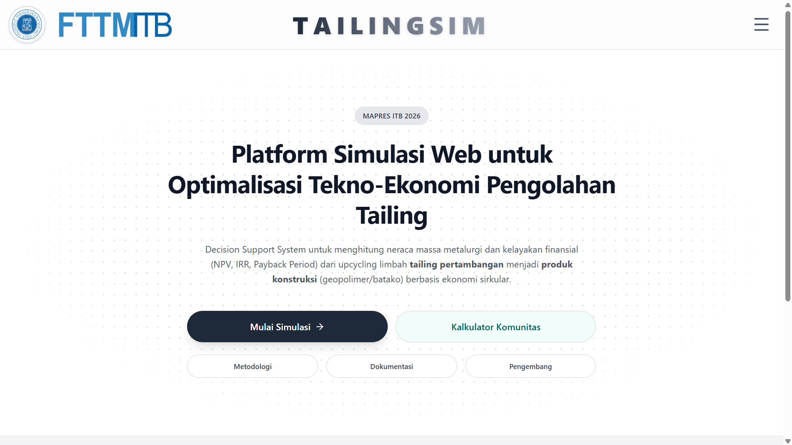

<div align="center">
  
  &nbsp;&nbsp;&nbsp;&nbsp;
  
</div>

<h1 align="center">TAILINGSIM</h1>
<h3 align="center">Platform Simulasi Web untuk Optimalisasi Tekno-Ekonomi Pengolahan Tailing</h3>

<p align="center">
  
</p>

## Deskripsi Proyek

TAILINGSIM adalah sebuah _Decision Support System_ (Sistem Pendukung Keputusan) yang dirancang untuk menghitung neraca massa metalurgi dan kelayakan finansial dari proses _upcycling_ limbah tailing pertambangan menjadi produk konstruksi (geopolimer dan batako) yang bernilai guna. Pengembangan platform ini berlandaskan pada prinsip ekonomi sirkular.

Platform ini mengintegrasikan:
- **Simulasi Parameter Fisik:** Densitas, porositas, dan kuat tekan.
- **Analisis Neraca Massa & Energi:** Reaksi alkali-aktivasi dan geopolimerisasi.
- **Kalkulasi Tekno-Ekonomi:** _Net Present Value_ (NPV), _Internal Rate of Return_ (IRR), dan _Payback Period_.
- **Kalkulator Pemberdayaan BUMDes:** Konversi teoretis simulasi ke dalam satuan lapangan (karung, sak, kg) yang dapat dieksekusi oleh masyarakat lokal, lengkap dengan pemantauan standar keamanan uji _Toxicity Characteristic Leaching Procedure_ (TCLP) sesuai PP No. 22 Tahun 2021.

## Tim Pengembang
Dikembangkan dalam lingkup kompetisi MAPRES ITB 2026.

- **Muhammad Ilham Saripul Milah**
  Lead Researcher & Full-Stack Developer
  Teknik Metalurgi, Fakultas Teknik Pertambangan dan Perminyakan (FTTM)
  Institut Teknologi Bandung (ITB)

## Panduan Pengembang

### Prasyarat
- Node.js (V18 atau lebih baru)
- npm / yarn

### Instalasi dan Menjalankan Proyek
1. Lakukan instalasi dependensi:
   ```bash
   npm install
   ```
2. Jalankan server pengembangan lokal:
   ```bash
   npm run dev
   ```
3. Akses antarmuka pada `http://localhost:3000` di peramban mesin uji Anda.

## Basis Pengetahuan dan Sitasi
Algoritma simulasi, parameter densitas curah, batas TCLP, dan data teknis penyusun algoritma TAILINGSIM didasarkan pada riset literatur yang diintegrasikan secara penuh pada modul Kalkulator Komunitas. Rujukan lengkap dapat ditemukan pada halaman Dokumentasi Metodologi di dalam platform.